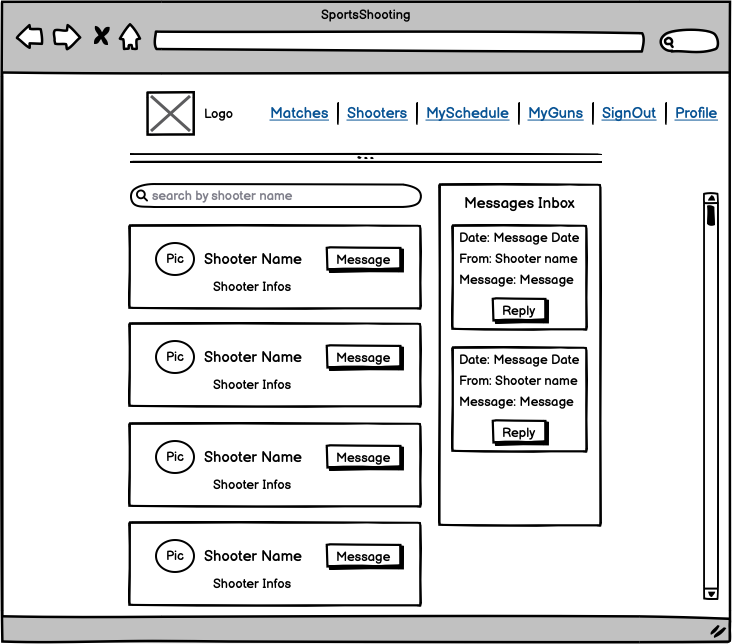

# SportsShooting

SportsShooting is a site, which should support Sportsshooters and their related clubs, to create match events or gather information about matches. The main target audience are licensed IPSC (International Practical Shooting Confederation) shooters. [IPSC](https://www.ipsc.org/) is a worldwide organized confederation of practical shooters.

It should build a plattform, where the registered user can gain more information about a particular match. He has the option to "attend" a match by clicking the related button, which will make it possible for other registered user, to see who is attending.

We as IPSC Shooters often attend matches and therefore travelling is essential. This app should help to find other IPSC shooters, who attend the same match and therefore can travel together. IPSC Matches are all classified withing "Levels", which have a distinct meaning:

- Level 1: Club matches, Trainings
- Level 2: Matches open to participants from different clubs
- Level 3: Regional matches, i.e. national championships or other large matches
- Level 4: Continental championships, i.e. the European or Pan-American Championship
- Level 5: The World Shoots

For this reason, the plattform provides predefined "Level" filters in order to navigate quicker.

A registered user will also have the possibility to comment on match listings and therefore get in contact with fellow colleagues.

If one is attending lots of matches, it can become difficult to track them, therefore the app shows all upcoming events, where a user has registered for.

The plattform also gives the IPSC Shooter the option to create his own and private gun collection site. There he can inventorise his collection.

Further messaging and collaboration featuers are built in.

Link to deployed SportsShooting site: [SportsShooting](https://sportsshooting-rpf13-d2b23798b278.herokuapp.com/)

Link to the deployed backend Django API: [SportsShooting API](https://sportsshooting-drf-rpf13-5060e23f8756.herokuapp.com/)

Link to the backend Django API repository: [SportsShooting API Repo](https://github.com/rpf13/sportsshooting_drf)

`INSERT AM I RESPONSIVE HERE`

---

Workaround for Node Version

In order to run the project correctly on gitpod, one has to use the following node verision command

`nvm install 16 && nvm use 16`

---

## User Stories
### Nav & Auth

- Navigation - View Navbar: As a user I can view a navbar from every page so that I can navigate easily between pages: [Link](https://github.com/rpf13/sportsshooting_react/issues/1#issue-1818297489)
- Authentication - Sign up: As a user I can create a new account so that I can access all the features for signed up users: [Link](https://github.com/rpf13/sportsshooting_react/issues/2)
- Authentication - Sign in: As a user I can sign in to the app so that I can access functionality for logged in users: [Link](https://github.com/rpf13/sportsshooting_react/issues/3)
- Authentication - Logged in Status: As a user I can tell if I am logged in or not so that I can log in if I need to: [Link](https://github.com/rpf13/sportsshooting_react/issues/4)
- Authentication - Refreshing access tokens: As a user I can maintain my logged-in status until I choose to log out so that my user experience is not compromised: [Link](https://github.com/rpf13/sportsshooting_react/issues/5)
- Navigation: Conditional rendering: As a logged out user I can see sign in and sign up options so that I can sign in/sign up: [Link](https://github.com/rpf13/sportsshooting_react/issues/6)
- Navigation - Avatar: As a user I can view user's avatars so that I can easily identify users of the application: [Link](https://github.com/rpf13/sportsshooting_react/issues/7)

### Matches Add & Attend

- Matches - Create a match: As a logged in user I can create matches so that I can share the event to fellow shooters: [Link](https://github.com/rpf13/sportsshooting_react/issues/8)
- Matches - View a match: As a user I can view the details of a single match so that I can learn more about it: [Link](https://github.com/rpf13/sportsshooting_react/issues/9)
- Matches - Attend a match: As a logged in user I can attend a match via clicking the related button so that I can show that I am attending: [Link](https://github.com/rpf13/sportsshooting_react/issues/10)
- Matches - Remove Attend a match: As a logged in user I can remove the attend a match via clicking the related button so that I can remove my participation info.: [Link](https://github.com/rpf13/sportsshooting_react/issues/11)
- Matches - View most recent matches: As a user I can view all the most recent matches, ordered by most recently created first so that I am up to date with the newest content: [Link](https://github.com/rpf13/sportsshooting_react/issues/12)
- Matches - Search functionality: As a user, I can search for matches with keywords, so that I can find the matches I am most interested in.: [Link](https://github.com/rpf13/sportsshooting_react/issues/13)
- Matches - Filter functionality: As a user, I can Filter for matches based on the IPSC Levels, so that I can find the matches I am most interested in.: [Link](https://github.com/rpf13/sportsshooting_react/issues/14)
- Matches - Infinite scroll: As a user I can keep scrolling through the matches on the site, that are loaded for me automatically so that I don't have to click on "next page" etc: [Link](https://github.com/rpf13/sportsshooting_react/issues/15)

### Match Detail

- MatchDetail - View Details: As a user I can view the individual match page so that I can read the details comments about the match: [Link](https://github.com/rpf13/sportsshooting_react/issues/16)
- MatchDetail - Edit Match: As a match event owner I can edit my event title and description so that I can make corrections or update my event after it was created: [Link](https://github.com/rpf13/sportsshooting_react/issues/17)
- MatchDetail - Delete Match: As a match event owner I can delete my match event so that all details and comments are deleted: [Link](https://github.com/rpf13/sportsshooting_react/issues/18)
- MatchDetail - Create a comment: As a logged in user I can add match comments to a event so that I can share my thoughts about the event: [Link](https://github.com/rpf13/sportsshooting_react/issues/19)
- MatchDetail - Comment date: As a user I can see how long ago a comment was made so that I know how old a comment is: [Link](https://github.com/rpf13/sportsshooting_react/issues/20)
- MatchDetail - View comments: As a user I can read comments on match events so that I can read what other users think about the match: [Link](https://github.com/rpf13/sportsshooting_react/issues/21)
- MatchDetail - Edit a comment: As an owner of a comment I can edit my comment so that I can fix or update my existing comment: [Link](https://github.com/rpf13/sportsshooting_react/issues/22)
- MatchDetail - Delete comments: As an owner of a comment I can delete my comment so that I can control removal of my comment: [Link](https://github.com/rpf13/sportsshooting_react/issues/23)
- MatchDetail - Attending Shooters: As a user I can see which users are attending a match so that I can get useful information: [Link](https://github.com/rpf13/sportsshooting_react/issues/24)

### Profile

- Profile - Profile page: As a user I can view other users profiles so that I can see their posted match events and learn more about them: [Link](https://github.com/rpf13/sportsshooting_react/issues/25)
- Profile - Edit profile: As a logged in user I can edit my profile so that I can change my profile picture and infos: [Link](https://github.com/rpf13/sportsshooting_react/issues/26)
- Profile - Update username and password: As a logged in user I can update my username and password so that I can change my display name and keep my profile secure: [Link](https://github.com/rpf13/sportsshooting_react/issues/27)

### MySchedule

- MySchedule - List matches: As a logged in user I can view a list of all matches I am attending, so that I can have a simple view and scheduling option: [Link](https://github.com/rpf13/sportsshooting_react/issues/28)
- MySchedule - MyNextMatches: As a logged in user, I can see a widget of my next three matches I am attending, so that I can have a very simple and fast view of my next match event: [Link](https://github.com/rpf13/sportsshooting_react/issues/29)
- MySchedule - Search functionality: As a logged in user, I can search within the list of myschedule with keywords, so that I can find the match I am looking for: [Link](https://github.com/rpf13/sportsshooting_react/issues/30)

### MyGuns

- MyGuns - Create an entry: As a logged in user I can create an entry in my gun database so that I can create my collection of guns: [Link](https://github.com/rpf13/sportsshooting_react/issues/31)
- MyGuns - List entries: As a logged in user I can list all entries in my gun database so that I can have an overview about my gun collection: [Link](https://github.com/rpf13/sportsshooting_react/issues/32)
- MyGuns - Edit an entry: As a logged in user / owner of an entry I can edit an entry so that I can fix or update my existing item: [Link](https://github.com/rpf13/sportsshooting_react/issues/33)
- MyGuns - Delete an entry: As a logged in user / owner of an entry I can delete an item so that I can remove it from my gun database: [Link](https://github.com/rpf13/sportsshooting_react/issues/34)
- MyGuns - Search functionality: As a logged in user, I can search for guns with keywords, so that I can find the gun I am looking for: [Link](https://github.com/rpf13/sportsshooting_react/issues/35)
- MyGuns - Filter functionality: As logged in user, I can Filter my gun database based on type “rifle” or “handgun”, so that I can find the item in the related category: [Link](https://github.com/rpf13/sportsshooting_react/issues/36)

### Testing & Documentation & Deployment

- Testing - Execute Testing: As a developer I can execute all necessary tests so I can make sure my application is working fine and I can fulfil the requirements given for this project: [Link](https://github.com/rpf13/sportsshooting_react/issues/37)
- Documentation - Create README: As a developer I can write the README documentation based on the guideline so another coder can understand how the project was built: [Link](https://github.com/rpf13/sportsshooting_react/issues/38)
- Deployment - Execute Deployment: As a developer I can execute the final deployment on Heroku so I can submit my PP5 project to CI: [Link](https://github.com/rpf13/sportsshooting_react/issues/39)

### Stretch User Stories

#### Shooters - Messages

- Shooters - List all Shooters: As a logged in user I can see a list of all registered shooters so I can learn more about who is who: [Link](https://github.com/rpf13/sportsshooting_react/issues/40)
- Shooters - Search functionality: As a user I can search among all registered shooters, so I can quickly find the user I want: [Link](https://github.com/rpf13/sportsshooting_react/issues/41)
- Shooters Message - Create a message: As a logged in user I can create a message sent to another user, so I can communicate privately: [Link](https://github.com/rpf13/sportsshooting_react/issues/42)
- Shooters Message - Receive a message: As a logged in user I can receive a message sent to me, so I can read and reply to it. -> CouldHave: [Link](https://github.com/rpf13/sportsshooting_react/issues/43)

---

## UX & Design

### Color Scheme

---

### Typography

---

### Wireframes

The Wireframes are the prototype of this project and show the base idea and the skeleton of the app. Even though this repo is mainly used for the API backend, the Wireframes of the frontend application do still have a crucial impact, since they define the data to be consumed.. I've used [Balsamiq](https://balsamiq.com/wireframes) to design my site wireframes.

Mobile Wireframe

  

Desktop Wireframe

  

---

# Features

---

## Tools & Technologies Used

---

## Development

The following chapters describe why and how I have choosen to code certain parts the way they are. This section should give an explanation to my thinking process and explain the reader some conceptual decisions.

### Commit messages

I have decided to mostly use multiline commit messages. Commit messages are an essential part of the whole project and a single line commit message is just not enough to explain. After reading [this interesting article](https://cbea.ms/git-commit/), it was clear to me, that I have to use it.

I have decided to use (mostly) multiline commits, but using tags as described this [cheatsheet](https://cheatography.com/albelop/cheat-sheets/conventional-commits/) or as also described in the LMS of the Code Institute. I did use the following syntax guidline:
- **feat:** for feature which may or may not include a CSS part
- **fix:** for a bugfix
- **style:** for changes to CSS or to give style to the code itself
- **docs:** for changes related to documentation
- **refactor:** for refactored code, re-written code
- **maint:** for general maintenance

---

## Agile Development Process

### Github Projects
[Github Projects](https://github.com/users/rpf13/projects/7) has been used as the Agile tool during the development phase of this project. The Kanban board was very useful to keep track on the tasks. I have created 4 columns (ToDo, In Progress, On Hold, Done) and moved the stories accordingly. 
The On Hold column has served as a "parking spaces", when a story was partially done, but not completely finished.

`ADD IMAGE TO KANBAN BOARD`

### GitHub Issues
[Github Issues](https://github.com/rpf13/sportsshooting_react/issues) has been used to create all the stories, before they were placed on the projects Kanban board. I have created an issues templates to simplify creation.
Each issue has a label for the MoSCoW prioritization.

Once a story has been created via the template, it will be automatically added to the Kanban board in the Todo column.

`ADD IMAGE TO GITHUB ISSUES`

### MoSCoW Prioritization

The MoSCoW prioritization has been used to divide all epics and stories into the following categories:

- MustHave: guaranteed to be delivered
- ShouldHave: adds significant value, but not mandatory for MVP
- CouldHave: adds value, would be nice to have
- WontHave: no priority for this iteration, acts as placeholder for future implementation

A related Github label has been created for each category and added to each epic, story - which makes it easy to identify and see the value it brings.

---

## Testing

Testing is covered in a separate page, view [TESTING.md](TESTING.md)

---

## Deployment

---

## Credits

### Code

### Content

### Media

---

### Acknowledgements

