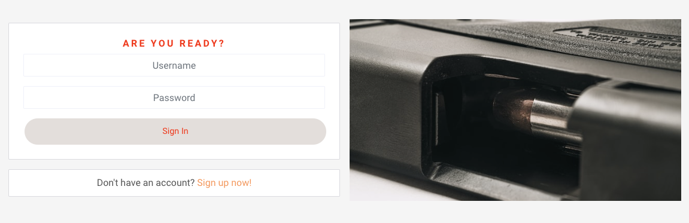
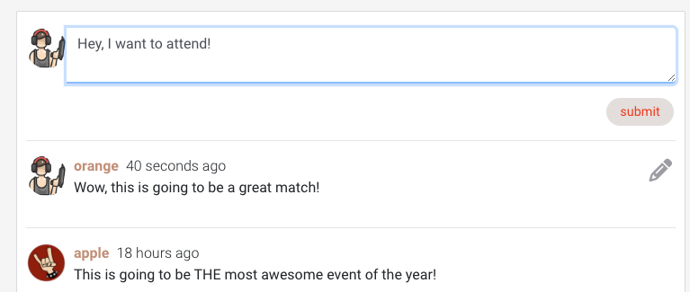
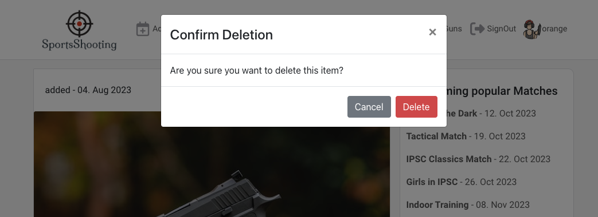

# SportsShooting

SportsShooting is a site, which should support Sportsshooters and their related clubs, to create match events or gather information about matches. The main target audience are licensed IPSC (International Practical Shooting Confederation) shooters. [IPSC](https://www.ipsc.org/) is a worldwide organized confederation of practical shooters.

It should build a plattform, where the registered user can gain more information about a particular match. He has the option to "attend" a match by clicking the related button, which will make it possible for other user, to see who is attending.


We as IPSC Shooters often attend matches and therefore travelling is essential. This app should help to find other IPSC shooters, who attend the same match and therefore can travel together. IPSC Matches are all classified within "Levels", which have a distinct meaning:

- Level 1: Club matches, Trainings
- Level 2: Matches open to participants from different clubs
- Level 3: Regional matches, i.e. national championships or other large matches
- Level 4: Continental championships, i.e. the European or Pan-American Championship
- Level 5: The World Shoots

For this reason, the plattform provides predefined "Level" filters in order to navigate quicker.

A registered user will also have the possibility to comment on match listings and therefore get in contact with fellow colleagues.

If one is attending lots of matches, it can become difficult to track them, therefore the app shows all upcoming events, where a user has registered for. A dedicated Upcoming Popular Matches component is visibile on many occasions, displaying the most popular matches. It should support the shooter to attend them too.

The plattform also gives the IPSC Shooter the option to create his own and private gun collection site. There he can inventorise his collection.

Link to deployed SportsShooting site: [SportsShooting](https://sportsshooting-rpf13-d2b23798b278.herokuapp.com/)

Link to the deployed backend Django API: [SportsShooting API](https://sportsshooting-drf-rpf13-5060e23f8756.herokuapp.com/)

Link to the backend Django API repository: [SportsShooting API Repo](https://github.com/rpf13/sportsshooting_drf)

---

## User Stories
### Nav & Auth

- Navigation - View Navbar: As a user I can view a navbar from every page so that I can navigate easily between pages: [Link](https://github.com/rpf13/sportsshooting_react/issues/1#issue-1818297489)
- Authentication - Sign up: As a user I can create a new account so that I can access all the features for signed up users: [Link](https://github.com/rpf13/sportsshooting_react/issues/2)
- Authentication - Sign in: As a user I can sign in to the app so that I can access functionality for logged in users: [Link](https://github.com/rpf13/sportsshooting_react/issues/3)
- Authentication - Logged in Status: As a user I can tell if I am logged in or not so that I can log in if I need to: [Link](https://github.com/rpf13/sportsshooting_react/issues/4)
- Authentication - Refreshing access tokens: As a user I can maintain my logged-in status until I choose to log out so that my user experience is not compromised: [Link](https://github.com/rpf13/sportsshooting_react/issues/5)
- Navigation: Conditional rendering: As a logged out user I can see sign in and sign up options so that I can sign in/sign up: [Link](https://github.com/rpf13/sportsshooting_react/issues/6)
- Navigation - Avatar: As a user I can view user's avatars so that I can easily identify users of the application: [Link](https://github.com/rpf13/sportsshooting_react/issues/7)

### Matches Add & Attend

- Matches - Create a match: As a logged in user I can create matches so that I can share the event to fellow shooters: [Link](https://github.com/rpf13/sportsshooting_react/issues/8)
- Matches - View a match: As a user I can view the details of a single match so that I can learn more about it: [Link](https://github.com/rpf13/sportsshooting_react/issues/9)
- Matches - Attend a match: As a logged in user I can attend a match via clicking the related button so that I can show that I am attending: [Link](https://github.com/rpf13/sportsshooting_react/issues/10)
- Matches - Remove Attend a match: As a logged in user I can remove the attend a match via clicking the related button so that I can remove my participation info.: [Link](https://github.com/rpf13/sportsshooting_react/issues/11)
- Matches - View most recent matches: As a user I can view all the most recent matches, ordered by most recently created first so that I am up to date with the newest content: [Link](https://github.com/rpf13/sportsshooting_react/issues/12)
- Matches - Search functionality: As a user, I can search for matches with keywords, so that I can find the matches I am most interested in.: [Link](https://github.com/rpf13/sportsshooting_react/issues/13)
- Matches - Filter functionality: As a user, I can Filter for matches based on the IPSC Levels, so that I can find the matches I am most interested in.: [Link](https://github.com/rpf13/sportsshooting_react/issues/14)
- Matches - Infinite scroll: As a user I can keep scrolling through the matches on the site, that are loaded for me automatically so that I don't have to click on "next page" etc: [Link](https://github.com/rpf13/sportsshooting_react/issues/15)
- Matches - Popular Matches: As a user I can see a widget of the most popular matches so that I can have a impression of the most wanted matches and decide whether I also want to attend or not [Link](https://github.com/rpf13/sportsshooting_react/issues/29)

### Match Detail

- MatchDetail - View Details: As a user I can view the individual match page so that I can read the details comments about the match: [Link](https://github.com/rpf13/sportsshooting_react/issues/16)
- MatchDetail - Edit Match: As a match event owner I can edit my event title and description so that I can make corrections or update my event after it was created: [Link](https://github.com/rpf13/sportsshooting_react/issues/17)
- MatchDetail - Delete Match: As a match event owner I can delete my match event so that all details and comments are deleted: [Link](https://github.com/rpf13/sportsshooting_react/issues/18)
- MatchDetail - Create a comment: As a logged in user I can add match comments to a event so that I can share my thoughts about the event: [Link](https://github.com/rpf13/sportsshooting_react/issues/19)
- MatchDetail - Comment date: As a user I can see how long ago a comment was made so that I know how old a comment is: [Link](https://github.com/rpf13/sportsshooting_react/issues/20)
- MatchDetail - View comments: As a user I can read comments on match events so that I can read what other users think about the match: [Link](https://github.com/rpf13/sportsshooting_react/issues/21)
- MatchDetail - Edit a comment: As an owner of a comment I can edit my comment so that I can fix or update my existing comment: [Link](https://github.com/rpf13/sportsshooting_react/issues/22)
- MatchDetail - Delete comments: As an owner of a comment I can delete my comment so that I can control removal of my comment: [Link](https://github.com/rpf13/sportsshooting_react/issues/23)
- MatchDetail - Attending Shooters: As a user I can see which users are attending a match so that I can get useful information: [Link](https://github.com/rpf13/sportsshooting_react/issues/24)


### Profile

- Profile - Profile page: As a user I can view other users profiles so that I can see their posted match events and learn more about them: [Link](https://github.com/rpf13/sportsshooting_react/issues/25)
- Profile - Edit profile: As a logged in user I can edit my profile so that I can change my profile picture and infos: [Link](https://github.com/rpf13/sportsshooting_react/issues/26)
- Profile - Update username and password: As a logged in user I can update my username and password so that I can change my display name and keep my profile secure: [Link](https://github.com/rpf13/sportsshooting_react/issues/27)

### MySchedule

- MySchedule - List matches: As a logged in user I can view a list of all matches I am attending, so that I can have a simple view and scheduling option: [Link](https://github.com/rpf13/sportsshooting_react/issues/28)
- MySchedule - Search functionality: As a logged in user, I can search within the list of myschedule with keywords, so that I can find the match I am looking for: [Link](https://github.com/rpf13/sportsshooting_react/issues/30)

### MyGuns

- MyGuns - Create an entry: As a logged in user I can create an entry in my gun database so that I can create my collection of guns: [Link](https://github.com/rpf13/sportsshooting_react/issues/31)
- MyGuns - List entries: As a logged in user I can list all entries in my gun database so that I can have an overview about my gun collection: [Link](https://github.com/rpf13/sportsshooting_react/issues/32)
- MyGuns - Edit an entry: As a logged in user / owner of an entry I can edit an entry so that I can fix or update my existing item: [Link](https://github.com/rpf13/sportsshooting_react/issues/33)
- MyGuns - Delete an entry: As a logged in user / owner of an entry I can delete an item so that I can remove it from my gun database: [Link](https://github.com/rpf13/sportsshooting_react/issues/34)
- MyGuns - Search functionality: As a logged in user, I can search for guns with keywords, so that I can find the gun I am looking for: [Link](https://github.com/rpf13/sportsshooting_react/issues/35)
- MyGuns - Filter functionality: As logged in user, I can Filter my gun database based on type “rifle” or “handgun”, so that I can find the item in the related category: [Link](https://github.com/rpf13/sportsshooting_react/issues/36)

### Testing & Documentation & Deployment

- Testing - Execute Testing: As a developer I can execute all necessary tests so I can make sure my application is working fine and I can fulfil the requirements given for this project: [Link](https://github.com/rpf13/sportsshooting_react/issues/37)
- Documentation - Create README: As a developer I can write the README documentation based on the guideline so another coder can understand how the project was built: [Link](https://github.com/rpf13/sportsshooting_react/issues/38)
- Deployment - Execute Deployment: As a developer I can execute the final deployment on Heroku so I can submit my PP5 project to CI: [Link](https://github.com/rpf13/sportsshooting_react/issues/39)

### Stretch User Stories - Not implemented

#### Shooters - Messages

- Shooters - List all Shooters: As a logged in user I can see a list of all registered shooters so I can learn more about who is who: [Link](https://github.com/rpf13/sportsshooting_react/issues/40)
- Shooters - Search functionality: As a user I can search among all registered shooters, so I can quickly find the user I want: [Link](https://github.com/rpf13/sportsshooting_react/issues/41)
- Shooters Message - Create a message: As a logged in user I can create a message sent to another user, so I can communicate privately: [Link](https://github.com/rpf13/sportsshooting_react/issues/42)
- Shooters Message - Receive a message: As a logged in user I can receive a message sent to me, so I can read and reply to it. -> CouldHave: [Link](https://github.com/rpf13/sportsshooting_react/issues/43)

---

## UX & Design

The overalll goal of the application was to achieve the desired functionality with a minimalistic and clear design. Colours should only be used to give an accent to something or display a certain funciont, like the buttons or the navbar active elements.
Overall, the application is mobile friendly, the use of mobile devices has always been part of the design decision process.

### Color Scheme

[Coolors.co](https://coolors.co/) hase been used to create the color palette. There is two sets of color schemes used in the application, where as they have many similarities. The main application uses a mixture of white / grey colors, paired with red to give some accents. The main background is `#f5f5f5`, which is a light grey color. It should give a simple accent over the pure white `#ffffff` navbar and component background.
Since also the individual match and gun collection items use the pure white as background, scrolling over the elements gives a nice "floating" effect.


The navbar but mostly the buttons are using a mixture of red colors paired with either black or sort of grey. Two sorts of red are used, either the standard red `#ff0000` or the `#fff1f1`. Either the background or the font color is using one of them, also the hover effect is done with red. The background of the buttons is otherwise mostly the grey'ish `#cfced3` paired with red or black font color.


I am aware of the fact that this combination does partially not fullfil the contrast check. However, it is almost impossible to pair red with any other light color and pass a contrast check. Since the whole color scheme is around the SportsShooting Logo, which contains a red centered target, I wanted to use it throughout the site. However, I am pretty confident that due to the fact that the contrast issue is only on a few button and hover effect occation, it would also be very well usable for visual impaired users.

---

### Typography

[Google Fonts](https://fonts.google.com) has been used to create the fonts. The logo uses the quite special `Milonga` font, which gives a nice touch to the image of the logo.
The rest of the document uses `Roboto` with a alternative font of `sans-serif`.

 

---

### Wireframes

The Wireframes are the prototype of this project and show the base idea and the skeleton of the app. They have been slightly adjusted during the development of the project but they main concept and design idea never changed. I've used [Balsamiq](https://balsamiq.com/wireframes) to design my site wireframes.

<details>
<summary>Wireframe</summary>
  


</details>

---

## Data Model

This application, built with [React](https://react.dev/) has not data model by itself, since it consumes API's from the back end. The whole code and documentation of the the data model can be found in the coresponding DRF API repository: [SportsShooting API Repo](https://github.com/rpf13/sportsshooting_drf)

---

## Features

This section will explain each feature of the application

### Navigation (Navbar)

The navbar is the heart of the whole application. It welcomes the user with a very clear and distinct design. The usage should be pretty clear by looking at it.


As a (new) user entering the page, it will be in unauthenticated state. The navbar displays the distinct logo, which is an active link where as clicking on it, will bring the user always back to the home url. furthermore, the user can see three icons
- Matches
- SignIn
- SignUp

The matches icon appears red because it is active, it is the home url. This should give the user already hint about the functionality.
Hovering over the SignIn or SignUp icons will change their color, indicating that the user can click on it. Once clocked, the icon remains acive and hence turns color to red.


If a user is authenticated, the navbar looks slightly different but keeping the previously mentioned concept of functionality and design.
The following additional icons will show up:
- Add Match -> redirects to the form to create a new match entry
- Add Gun -> redirects to the form to create a new gun database entry
- MySchedule -> displays the user's personal match schedule
- MyGuns -> redirects to the "private" gun database
- SignOut
- Avatar with the currently logged in username next to it

### SignUp | SignIn

A user who wants to interract on the site and not just watch some content, needs to create a profile and therefore sign up. The SignUp icon on the navbar will bring him to the form, where he has to add minimal data. The form uses auto validation of the fields, meaning for example a too short password will display an error.

The image on the signup site shows some bullets, once in upward position. It should illustrate the purpose of this form, to "sign up".
If someone has clicked on the sing up by accident but already has an account, there is a cross link to the sign in form.


The sign in form welcomes the user with the sentence "Are you ready". This is taken from the IPSC rules, which we follow as part of our sport. It is basically one of the commands the shooter gets told, before he can start his run on a particular stage.
The image should illustrate the ready condition as well, the bullet comes from the magazine and gets loaded into the barrel.



Once the user is signed in, the sign out icon is always visible in the navbar.

### Matches | Main Site

The matches site is the main and home view of the application. It consists of different reusable components, which will show up independently on other sites.


The following elemets are part of the matches main site:
- search bar
- match level selection field
- main match component
- upcoming popular matches component

All of theses elements are available to all users, independet of their sign in status.
The matches list is sorted showing the last added match first. This will help users to see the latest additions quite easily, without searching a lot. Furthermore, the list will also contain matches from the past, since this part of the application should also act as kind of archive.

There is an infinite scroll of matches in place, while loading from the back end, a loading spinner will be dispalyed to the user.

#### Matches search & Level filter

The search bar on top of the matches site give the user the ability to search after the most common keywords like *title, location, advertiser*


There is also a pre defined *Level Filter* in place. As explained in the introduction section of this application, in IPSC shooting, all matches are categorised into levels, each of them having a clear meaning.


The two features can be combined to further filter down possible matches. This is exactly what a shooter who is looking after matches, wants. Search and Level filter will give this option:


#### Matches attend & comments

Besides match detail information, each match is also displaying the two active elements of *attending* with its *attendings count* as well as the *comment* and *comments count*


If a user is logged in, he can click the attend icon to add himself to the list of attending shooters. If so, the icon will be transform to red and keep this color until the logged in user clicks again on it to unattend.
It is **important** to note, that also the user who added the match can attend *his own* match. This is a must have feature. The count displays how many shooters are attending.
Furthermore, he can click on the comments icon, which brings him to the match detail site, where he can see and add a comment. The count displays how many comments have been written.

If a user is not logged in, he can see both components, however, he will not be able to attend a match. While trying to attend, a message will be displayed that only logged in users can use this feature.


Clicking on the comments field will also bring this user to the match detail site, where he can read the comments *but is unable* to add a comment.

#### Upcoming popular Matches Component

The Upcoming popular Matches component is a dedicated separated component, visible on the matches site. It contains a list of the most popular matches, measured on how many shooters are attending. To keep the list kind of visible, it is limited to 6 entries on desktop and 4 entries on mobile.


The list only contains matches hapening in the future, popular matches from past are filtered out. Furthermore it is sorted by the most recent match being first in the list. If the user is hovering over the events, the will change the color to red, to show it is an active link. With this, the navigation is inline with the rest of the site.
Clicking on such a link will bring the user to the match detail page.

### Match Detail

Once the user clicks on an individual match in the matches list, or he clicks on one of the listed matches in the *Upcoming Popular Matches* component, he will be presented with the details of the particular match, which contains a variety of additional information but still keep the design minimalistic.


On the top, the avatar and username of the *advertiser*, the one who added the match, is displayed. There is an active link behind, if clicked, the user profile will be displayed. Furthermore the date when the event was last updated is shown, next to the edit icon.

Besides the displayed image, the main title of the match, together with the event date is shown. Further infos like the match location, IPSC Level, Division and match details are shown.
Underneath that, the two active components *attending* with its *attendings count* as well as the *comment* and *comments count* are displyed. Their usage has already been explained in the matches section.

#### Comments

The comments section lets the users see all comments, the logged in user will also see the form to add a comment. The avatar is again an active link to the user's profile.



The user has also the option to edit or delete his comment. All comments of the logged in user will display the edit icon, which will give the option to edit or delete.


The comments section is also using the infinite scroll, displaying a loading spinner once more data is fetched from the API.

### Add Match

The *Add Match* icon on the havbar will redirect the logged in user to a form, where he can create a new match entry.


The form gives the option to add the following mandatory fields:
- Title
- Match Date
- Location
- Image

These fields are mandatory becasue without them, an advertisement of a match does not make sense...furthermore the application is based on "visuals", hence a match entry without an image would not be nice.
The image upload is limited to max. 2MB or 4096 x 4096 pixels in order to stay within the Cloudinary's free hosting plan.
If the user tries to submit the form and violating one of the mandatory fields, a respective error is displayed.

The following fields are optional:
- Division
- Level is a choice field, per default it will be Level-1
- Details

Clicking on the cancel button will bring the user back to the site he came from.

### Edit | Delete Match

If the owner of a particular match is logged in and has navigated to the match detail view of a particular match, he has the option to edit.
The respective icon is only visible for the owner of the match and once clicked, the icon becomes active and displays the opton to delete or edit a match.


The delete functionality is straight forward, however in order to prevent unwanted deletion, a confirmation modal message is presenten upon pressing the delete button.


The user has then the choice to either cancel deletion or confirm it. Deleting the match entry will delete all related child entries like comments, attendings, ...

If the user decides to edit a match, he can do so via clicking the respective icon.


The edit form gets displayed where all the fields are pre populated with the existing data. The user can adjust any of them or choose to cancel the operation, which will bring him back to the match detail view. All the attendings or comments are kept in any case (updating or cancellign the update operation).

#### Participating Shooters

The Participating Shooters component, is a reusable component, which got added here.


This component displays all shooters who have clicked *attend*. It should give the user or a possible organisator / advertiser of a match, an overview on how many will attend and who. It is also interesting for fellow shooters, since some have preferences.
The list can be extensively long, therefore I have implemented a limit in size. On desktop the component is allowed to grow max. to 400px in height, on mobile it is limited to only 90px height, which is just engough to display two rows of avatars. The rest of the content, if exceeding the limit, will be hidden and accessible via the scrollbar.


If the user clicks on an avatar, he will be redirected to the respective user profile component.

### MySchedule

MySchedule is only accessible for a logged in user. It is not a component or a page by itself, it is only re-using existing parts and components. This showcases the beauty of such a React app.


It's look is almost identical to the Matches page, but this time it is optimised for a particular user. The MySchedule site, as the name implies, is personal. It will display all matches a particular user is attending. The main pourpose is to help the shooter to have a list of his upcoming events.
All filter functionality, including the additional featurs of attending an event or commenting on an event, remain the same as for the matches site.
Clicking on a particular match, will bring the user again to the match detail view, which has been previously described.
In addition to the personal schedule, alos the component with the *Upcoming popular Matches* is displayed again, which should help the shooter to see whether he is missing an popular event or not.

### MyGuns

The MyGuns site is also only available for logged in user. Furthermore it is personal. A user cannot see content of another user.


This site acts as a personal database of the shooters own gun collection. It is not really related to the IPSC sport, he can add whatever gun he wishes. Many shooters are also in other clubs, for example for precision rifle shooting, long distance shooting.
This part of the application should give the option to store and sort the collection.

The main component is the gun database entry itself, dispalying the add and updated fields. This can be great value, depending on how a collector is managing his collection. By default the list of guns is sorted with the most recent entry first.
Below the image section, there is the brand and type field - probalby the most important fields. In addition to that, the type field (pre defined as either handgun or rifle) can be seen. The last field is the content field, where the user can add whatever he wants in order to describe the item.

#### MyGuns Search and Type filter

On the top, the user gets displayed the (familiar) search and selection option. He can search based on a brand, model or serailnumber.
The filter option is there to differentiate between handgun and rifle. If a user has a large collection, this can be a handy feature. Furthermore, filter and search can be combined.


#### MyGuns Upcoming Popular Matches Component

Like in the match detail view, also in the MyGuns list as well as in the Gun detail view, the *Upcoming popular Matches* component gets reused. Since this site has its primary focus on matches listing, it should encourage the user as much as possible to attend as well.
In a future version, another component will be added at this place, see [Future Features](#future-features) section.

#### Add Gun

The Gun add icon, located in the navbar, will direct the logged in user to the gun create form.


Mandatory fields are
- Brand
- Gun Model
- Image

If these fields are not filled, an error message will be displayed.


The other fields are optional:
- Type field is a choice field and the default is set to handgun.
- Serial Number
- Details

If the user decides to cancel, he will be redirected back to where he came from.

### Gun Detail | Edit & Delete

Once the user clicks on a particular entry in his gun database, he will see the details of such an entry.


The information, which he will be presented is pretty much the same as on the list view, but here he has the option to edit or delete an entry. The concept is the same like on match entry. If he selects deletion, a modal will be presented to ask for confirmation. Cancel will bring him back to the detail view.



The edit buton will open the edit form, with all the data pre populated. The user can edit all data, including the image. The cancel button will close the form and bring him back to the detail view.


### Profiles

The last section is the profiles site. The site itself is accessible for all visitors, even if not signed in. When the profile / avatar is clicked in any of the components as well as the navbar, the user will be displayed the profile page.


The difference between a signed in and a signed out user is, that once the user is signed in and visiting his own profile, he will be displayed the *edit profile* button.

The site displays hte bio of the shooter aas well as some more club and shooter related information. As separate section with contact details is shown.
The site will also display all matches, created by this particular user. This can be very handy and an alterntive way, besides the search functionality, to find content of a particular shooter.
Clicking on a match event, will bring him to the match detail site.

The *Upcoming popular Matches* component is reused again. The functionality of it has been described previously.

### Edit Profile

Initially, once the user has signed up, all fields will be empty, so it is very much desired, that a user visits this section.
The signed in user can edit his profile via clicking on the edit icon.


He is displayed with the option to edit his username, his password or the profile. Edit username or password will bring him to the respective form, where as its containing cancel button will bring him back to the profile section.

 

The edit profile section will let him update all the fields. 


All of the profile edit form fields are optional, meaning no error gets displayed, if the user submits an empty form. This is intentionally correct because instead of pressing the cancel button, the user might just press submit.
Also the avatar image is not mandatory, if not change, the default image will be used further.
The mail and social media fields contain a placeholder text, just to make sure the user will add them in the correct form. If not, an error will be shown - however, the fields can be left blank.

If the new user cancels the form submission or submits it empty, he will be sent back to the profile details. If everything is empty and he did not add a match yet, the *empty logo* will be displayed.


Certianly a profile update and submussion will result in updating the profile section as well as updating the avatar image on all components and related comments, match entries.

---

### Features left to implement

Keeping the deadline of this project in mind and also the agile approach of development, the current state covers a great MVP solution. However, the application can be improved in future product iterations.
One feature in particular did not make it to the front end implementation and that was the usermessage feature. It is covered with the user stories
- [Create a message](https://github.com/rpf13/sportsshooting_react/issues/42)
- [Receive a message](https://github.com/rpf13/sportsshooting_react/issues/43)

where as both of them would have been part of a new *Shooters* Component, covered with the stories
- [List all Shooters](https://github.com/rpf13/sportsshooting_react/issues/40)
- [Shooters Search Functionality](https://github.com/rpf13/sportsshooting_react/issues/41)

The aim should be to create a new component, dedicated to the shooters, listing all of them and give a variety of filter and choice field options. Furthermore it should act a the "direct messaging" center, where it is possible for a logged in user to send messages to another user. Maybe the whole idea could be transformed even futher into a live chat functionality.

Anyway, the back end part of the messaging feature got already implemented as a stretch objective of the DRF API project. In the [README of the back end project](https://github.com/rpf13/sportsshooting_drf/tree/main#usermessages), there is a [chapter](https://github.com/rpf13/sportsshooting_drf/tree/main#usermessages) dedicated to the usermessages, including the related code. The code got removed on the final deployed project, since no unused code should be deployed.

### Future Features

In future iterations some more additional features could be implemented. Here some examples, which are on the list:

- smart logic to automatically delete historical events after 1 year
- create new component to be added in the MyGuns section, which displays content of the [gunbroker.com](https://www.gunbroker.com) plattform via using their [REST API](https://api.gunbroker.com/User/Help). Gunbroker.com is a very large trading plattform for selling guns and accessories. It would be a very cool feature to have something like that as a dedicated component in the MyGuns section.
- it would be a good feature if the user can delete his own profile. This has not been done yet and it is already adressed via a future story in the back end DRF repo. See the [following story](https://github.com/rpf13/sportsshooting_drf/issues/7) for this feature.
- the JWT json web token feature should be refactored to use the more secure httpOnly cookie, which is not accessible by java script. This is also already added as [future story](https://github.com/rpf13/sportsshooting_drf/issues/40) in the DRF back end repo.
- I really want to dig deeper into the *cross origin problem* and the relation to the different browsers. I have figured out that, especially on mobile or the iPhone, it can become a challenge. However, there must be solutions for it, also in case the front-, and back end projects deployed on different applications. In real world, this is the case so many times. I want to understand this fact and then adjust my application.
- I have to do more research about `DateTime` formats. Even though I did some tweaking of the DateTime format in my app, via the back end in the Django REST part, in combination with the *day adjustment* including a dot (as described in this README), I want to bring it to a better, next level based on the back end.
- Refactor the ErrorMessage Modal in order to accept dynamic inputs in order to have it even more generic and reusable. See also explanation in [Code Notes](#code-notes) chapter.

---

## Re-useable components and helpers

### `Asset.js (spinner)`

The `Asset` component is a reuseable component to display a spinner, an image, or a message based on the props passed to it. 

- If the `spinner` prop is provided and set to `true`, a spinner from the "react-bootstrap" library will be displayed.
- If the `src` prop is provided, an image with that source URL will be rendered with the `alt` attribute set to the `message` prop's value.
- If the `message` prop is provided, a paragraph text with the given message will be displayed beneath the image or spinner.

The `Asset` component uses some further styling, which is defined in the `Asset.module.css` file. This component has been used widely in the application to display the loading spinner, while fetching more data from the API.


### `Avatar.js`

The `Avatar` component provides a reuseable component, mainly used in our app for the user profiles.

- The component accepts a `src` prop which stands for the image source URL for the avatar.
- It has a default height of `45` pixels for the image which can be overridden with the `height` prop. In the app, it gets overwritten on a few places.
- The width of the image is set to be the same as its height, ensuring the image maintains a square shape.
- An optional `text` prop can be passed to display a label or description alongside the avatar image.

The styling comes from the `Avatar.module.css` file.

### `DeleteModal.js`

The `DeleteModal` component is used in two places of the application, when deleting a match or when deleting a gun object.
It uses the following elements

- **Hidden or Visible**: It uses the `show` prop to determine if the modal should be displayed or hidden.
  
- **Confirmation Prompt**: The modal displays the question to the user – "Are you sure you want to delete this item?" – ensuring the user is aware of the consequenses when deleting the object.

- **User Actions**:
  - **Cancel**: A "Cancel" button allows the user to dismiss the modal without performing any action. This triggers the `handleClose` callback when clicked and the user will stay on the detail element (match or gun object), where he came from.
  - **Delete**: The "Delete" button confirms the users intention to delete. Clicking this button triggers the `handleConfirm` callback and will delete the object.

I did not use any custom styling since I think the bootstrap styling for this modal looks great.

### `ErrorModal.js`

The ErrorModal component serves as a notification system for displaying error messages to the user. Since it is not a nice and good idea to keep all the console.log elements in the code, I wanted to create something "useful" from user perspective. The `try, catch` blocks are set, why also not using the catch?

The `ErrorModal` component serves as a notification system for displaying error messages to the user.

- **Visibility**: Its visibility is managed by the `show` prop. When `show` is `true`, the modal is visible, and when its `false`, the modal is hidden.
  
- **Message**: The modal displays a generic message – "Sorry, something went wrong! Try again later!" – which makes it suitable for general unexpected error scenarios.

- **Close Button**: The modal includes a "Close" button, allowing users to dismiss the error message. This button triggers the `onClose` callback

I did not leave the styling to the default bootstrap modal styling, which I think looks good.

**Integration into the App**:

To provide centralized management of the error state and to make the modal accessible throughout the application, the `ErrorModal` was integrated using React's Context API [Link](https://legacy.reactjs.org/docs/context.html)

- **Error Context Creation**: An Error Context was created, which provides both the current error state and a function to set the error. This allows any component in the app to trigger the modal by setting an error. This was my target goal for creating this funcitonality, since I think it is a great use of the react context functionality....and it did force me to read the documentation for it 

- **Provider Setup**: The main `App.js` file wraps the entire application inside the Error Context `Provider`. This ensures that any component, regardless of its depth in the component tree, has access to the error state and the function to set an error. This was exactly, what brought me back to the iniital explanation of a context via showing the problem of "handing over functionality" down the tree

- **State Management**: Within `App.js`, a state variable is maintained to control the visibility of the `ErrorModal`. Whenever an error is set, the modal is displayed, and the user can dismiss it using the `onClose` functionality.

- **Utility**: This setup allows any component in the application to display the `ErrorModal` by simply updating the error context, making it a versatile and reusable error handling mechanism.

### `MoreDropdown.js`

The `MoreDropdown` component, provides a dropdown menu represented by the three dots (`...`), visible on any content, where a user respectively the owner of an object, can edit it. It contains two main actions: "Edit" and "Delete". When clicked, each respective action is taken.

- **ThreeDots**: This is a custom toggle for the dropdown menu. The use of `React.forwardRef` ensures that the dropdown gets access to the DOM for positioning.
  
- **Dropdown Toggle**: It uses the `ThreeDots` component as the toggle button for the dropdown.
  
- **Dropdown Menu**: This contains two items:
  1. Edit: Represented by a pencil icon, when clicked, it triggers the `handleEdit` function.
  2. Delete: Represented by a trash can icon, when clicked, it trigggers the `handleDelete` function.

**Profile Edit Dropdown**

The `ProfileEditDropdown` is a similar dropdown like the `MoreDropdown` but specifically for the profile actions. Instead of general actions like the `MoreDropdown`, it contains three actions that relate are used in the profile section: "Edit Profile", "Change Username", and "Change Password".

- **Dropdown Menu**: This contains three items:
  1. Edit Profile: Navigates the user to the profile edit page.
  2. Change Username: Navigates the user to the username change page.
  3. Change Password: Navigates the user to the password change page.

The component uses the `useHistory` hook to handle navigation for each dropdown action.

The styling is handled by the `MoreDropdown.module.css` file

### `NotFound.js`

The `NotFound` component is used to inform users that the page they're trying to access doesn't exist or cannot be found. This component provides a user-friendly response to potential navigation errors or mistyped URLs.

- **Asset Component Usage**: The `NotFound` component reuses the previously explained `Asset` component, which displays an image and a message. Here, it's used to show a `NoResults` image alongside a message: "Sorry, the page you're looking for doesn't exist".
It is a perfect example to show how the `Asset component` can be used

Styling is defined in the `NotFound.module.css`.

### `FormatDay.js` helper

I did set the dateTime format already in the backend to a custom value. However, in the front end, I wanted that there is a dot after the day, like 13. Jun 2023. I am so used to this format, that I wanted to have it in my app.

So the `FormatDay` function is an utility that formats the date string to include a dot after the day segment.

- **Input**: This function takes in `props` as its argument, which can have one of three date-related attributes: `match_date`, `updated_at`, or `created_at`. These are the three date props, I have used throughout the app.

- **Functionality**: The core functionality of this function is to append a dot (.) right after the day segment in a date string. It uses a regular expression `/(\d+)/` to identify the day segment and then appends a dot to it.

- **Output**: The function returns the newly formatted date string with the dot added.

### Page components

If we look at the individual pages used for "MyGuns" as well as "Matches", they also make use of of reuseable components or elements. The `Match.js` and the `Gun.js` are also reused inside the pages. The "singular form", like `Gun.js` is always the base, fetching the data. Then `GunPage.js` and `GunsPage.js` take it a step further, use other components like the `ÀttendingShooters` or `PopularMatches`, and integrate them.

---

## Custom Hooks

The following custom hooks are used in this project

### `useClickOutsideToggle` 
The `useClickOutsideToggle` is a custom hook, which provides a mechanism to handle the expanded state of our navbar dropdown compnent and toggles it off when a click is detected outside of the component.
It uses the React embedded hooks `useEffect, useRef, useState` It initialises the state via the `useState` hook and sets the value to `false`. The `useRef` hook also gets initialise with a value of `null`, the ref will then be assigned to a DOM element.
The `useEffect` hook adds the event Listener to the document, that check if there is a mouse Up event. Inside the `handleClickOutside` function, it checks if the click event's target is outside the element referred to by `ref`. If it is, it sets expanded to false. 
The `useEffect` also returns a cleanup function, which makes sure, that the event listener is removed when the component that uses this hook is unmounted or if the ref changes
The return value of the hook is the object with the `expanded state`, the `setExpanded` function to toggle this state, and the `ref` that is assigned to the DOM element to detect clicks outside of it.

<details>
<summary>Code snippet</summary>

```jsx

import { useEffect, useRef, useState } from "react";

const useClickOutsideToggle = () => {
  // functionality to expand and close the navbar
  const [expanded, setExpanded] = useState(false);
  const ref = useRef(null);

  useEffect(() => {
    const handleClickOutside = (event) => {
      if (ref.current && !ref.current.contains(event.target)) {
        setExpanded(false);
      }
    };
    document.addEventListener("mouseup", handleClickOutside);
    return () => {
      document.removeEventListener("mouseup", handleClickOutside);
    };
  }, [ref]);

  return { expanded, setExpanded, ref };
};

export default useClickOutsideToggle;

```
</details>

### `useRedirect` 
`useRedirect` is another custom hook used in this project. It listens for changes in the user's authentication status. When there's a change, it tries to refresh the users authentication token. Depending on if thats a success or failure and the passed userAuthStatus, it redirects the user to the main route, which is the matches list.

The `useRedirect` Hook takes a single parameter, `userAuthStatus`, which indicates the user's authentication status. It makes use of the `useEffect` hook, which contains an async function of `handleMount`. A POST request is made to `/dj-rest-auth/token/refresh/` to refresh the users authentication token. If the request is successful and the `userAuthStatus` is "loggedIn", the user will be redirected to the root path, which is the matches list. If the request fails and hence, the user is logged out, it will also be redirected to the same root path.

It gets used on various places in the application.

<details>
<summary>Code snippet</summary>

```jsx

import axios from "axios";
import { useEffect } from "react";
import { useHistory } from "react-router-dom";

export const useRedirect = (userAuthStatus) => {
  const history = useHistory();

  useEffect(() => {
    const handleMount = async () => {
      try {
        await axios.post("/dj-rest-auth/token/refresh/");
        // if user is logged in, the following code will run
        if (userAuthStatus === "loggedIn") {
          history.push("/");
        }
      } catch (err) {
        // if user is not logged in, 401 error, following code will run
        if (userAuthStatus === "loggedOut") {
          history.push("/");
        }
      }
    };
    handleMount();
  }, [history, userAuthStatus]);
};

```
</details>

---

## Technologies, Libraries & Dependencies

There are a variety of libraries and dependencies required to run this project. The `package.json` file contains a list of required packages, in order to have the deployed version used the correct ones. The following list is a summary of the packages, including a link to the reference and a short description.

- **@testing-library/jest-dom** [Link](https://github.com/testing-library/jest-dom) Custom matchers to use with Jest in the context of Testing Library.
- **@testing-library/react** [Link](https://testing-library.com/docs/react-testing-library/intro/) Lightweight utility functions for testing React components.
- **@testing-library/user-event** [Link](https://github.com/testing-library/user-event) Simulate user events for testing React components.
- **axios** [Link](https://axios-http.com/docs/intro) Promise-based HTTP client for JavaScript which can be used in both the browser and Node.js environments. Used throughout the project to execute the API calls.
- **bootstrap** [Link](https://getbootstrap.com/docs/4.6/getting-started/introduction/) Framework for building responsive, mobile-first websites and web applications.
- **jwt-decode** [Link](https://github.com/auth0/jwt-decode) Allows decoding of JSON Web Tokens (JWT) to extract payload information.
- **react** [Link](https://reactjs.org/docs/getting-started.html) JavaScript library for building user interfaces.
- **react-bootstrap** [Link](https://react-bootstrap.github.io/) Bootstrap components built with React.
- **react-dom** [Link](https://reactjs.org/docs/react-dom.html) React package for working with the DOM (Document Object Model).
- **react-infinite-scroll-component** [Link](https://github.com/ankeetmaini/react-infinite-scroll-component) An infinite scroll component built with React.
- **react-router-dom** [Link](https://reactrouter.com/web/guides/quick-start) DOM bindings for React Router, a routing library for React.
- **react-scripts** [Link](https://github.com/facebook/create-react-app/tree/master/packages/react-scripts) Scripts and configuration used by Create React App.
- **web-vitals** [Link](https://web.dev/vitals/) Provides utility functions to measure performance metrics for a website.
- **msw (devDependency)** [Link](https://mswjs.io/) Mock Service Worker, an API mocking library for browser and Node.
- **Node.js** [Link](https://nodejs.org/docs/) JavaScript runtime built on Chrome's V8 JavaScript engine. It allows for the development of scalable network applications using JavaScript
- **npm** [Link](https://docs.npmjs.com/) The package manager for JavaScript, used to install and manage packages (libraries and applications)
- **babel-eslint** [Link](https://github.com/babel/babel-eslint) A wrapper around the Babel parser that makes it compatible with ESLint.

### Tools, Frameworks

- [React](https://react.dev/) has been used as the front end framework
- [React Bootstrap](https://react-bootstrap-v4.netlify.app/) has been used as the CSS framework for React
- [Git](https://git-scm.com) used for version control. (`git add`, `git commit`, `git push`)
- [GitHub](https://github.com) used for secure online code storage.
- [Gitpod](https://gitpod.io) used as a cloud-based IDE for development.
- [Heroku](https://www.heroku.com) used for hosting the deployed back-end site.
- [Cloudinary](https://cloudinary.com) used for dynamic file storage for all images.
- [Markdown Builder by Tim Nelson](https://traveltimn.github.io/markdown-builder) used to help generate the Markdown files.
- [Freelogodesign](https://www.freelogodesign.org) has been used to create the logo and upload images
- [jest](https://jestjs.io/) has been used for the JS unit testing
- [Balsamiq](https://balsamiq.com/) has been used to create the wireframes
- [Lighthouse](https://developer.chrome.com/docs/lighthouse/overview/) plugin for chrome used to check performance
- [Responsive Design Checker](https://www.responsivedesignchecker.com/) has been used to test the responsiveness of the site
- [ESlint ES7+ React](https://open-vsx.org/extension/dsznajder/es7-react-js-snippets) has been used as as plugin on Gitpod in order to validate the JS code. This has been a very big help finding missing semi colons, ...
- [Coolors](https://coolors.co) has been used to create the color palettes
- [Google Fonts](https://fonts.google.com) has been used for the fonts

---

## Development

The following chapter describes how I made use of the very useful commit message feature.

### Code Notes

At the final stage of the application, once doing the *defensive programming* tests, I did find quite some things, which are maybe not *optimal*. I have spent many hours trying to find solutions or alternative ways on how to tackle an issue. However, some things cannot just be changed, they would cause a redesign of the app.

One can say, that this is the *lessons learned* part and I somehow agree. I have learnt many things. For example I did not know until the end, that if I use react-bootstrap and "technically" just hide some content in the mobile view, it still gets rendered from a DOM perspective. So this fact causes some *nasty* problems and is also not very supportive for the loading time.

One particular change I did at the end I want to point out, is the following: I did change the behavior on how the `MyGuns` site behaves. Initially I had the below visible code in it. It would cover the case that if an *unauthenticated user* is trying to access the guns site, via directly entering the url in the browser like `/guns`, he would see a message telling: *"You are not authorized to view this content. Create an account and login first."*

However, I did not like that...I mean, this is just for a case, where the user is trying to do something, which he is not intended to do. Therefore I did implement current solution of redirecting the user back to the main route `"/"` if he tries to do the above mentioned.
Now in such cases it would be nice to display a particular error Modal message, which brought me to the problem that my ErrorModal implementaiton would have to be refactored to accept dynamic inputs. I did not want to refactor this at the stage the app has been, fully tested and ready to submit. I did open a "future feature" for it.

Here the code snippet for the `GunsPage.js` with the previously mentioned error message to be displayed (imports not included in the snippet).

<details>
<summary>Code snippet</summary>

```jsx

function GunsPage({ message }) {
  useRedirect('loggedOut')
  const [guns, setGuns] = useState({ results: [] });
  const [hasLoaded, setHasLoaded] = useState(false);
  const [hasError, setHasError] = useState(false);
  const { pathname } = useLocation();
  const currentUser = useCurrentUser();

  // used for search query
  const [query, setQuery] = useState("");
  const [gunType, setGunType] = useState("");

  useEffect(() => {
    const fetchGuns = async () => {
      try {
        const { data } = await axiosReq.get(`/guns?search=${query}&type=${gunType}`);
        setGuns(data);
        setHasLoaded(true);
      } catch {
        setHasError(true);
        setHasLoaded(true);
      }
    };

    // Only fetch guns when a user is logged in
    if (currentUser) {
      setHasLoaded(false);
      const timer = setTimeout(() => {
        fetchGuns();
      }, 1000);
      return () => {
        clearTimeout(timer);
      };
    } else {
      // If no user is logged in, set 'hasLoaded' and 'hasError' to true
      // which will cause re-render and display the not authorized error
      setHasLoaded(true);
      setHasError(true);
      setGuns({ results: [] }); // clear the guns state
    }
  }, [pathname, query, currentUser, gunType]);

  return (
    <Row className="h-100">
      <Col className="py-2 p-0 p-lg-2" lg={8}>
        <PopularMatches mobile />
        <i className={`fas fa-search ${styles.SearchIcon}`} />
        <Form
          className={styles.SearchBar}
          onSubmit={(event) => event.preventDefault()}
        >
          <FormControl
            value={query}
            onChange={(event) => setQuery(event.target.value)}
            type="text"
            className="mr-sm-2"
            placeholder="Search by brand, model, serialnumber"
          />

          <Form.Control
            as="select"
            placeholder="Choose GunType"
            value={gunType}
            onChange={(event) => setGunType(event.target.value)}
            className="mb-3"
          >
            <option value="">All Gun Types or Select</option>
            <option>Handgun</option>
            <option>Rifle</option>
          </Form.Control>
        </Form>
        {hasLoaded ? (
          hasError ? (
            <Container className={appStyles.Content}>
              <p>
                You are not authorized to view this content.
                <br />
                Create an account and login first.
              </p>
            </Container>
          ) : (
            <>
              {guns.results.length ? (
                <InfiniteScroll
                  children={guns.results.map((gun) => {
                    return <Gun key={gun.id} {...gun} setGuns={setGuns} />;
                  })}
                  dataLength={guns.results.length}
                  loader={<Asset spinner />}
                  hasMore={!!guns.next}
                  next={() => fetchMoreData(guns, setGuns)}
                />
              ) : (
                <Container className={appStyles.Content}>
                  <Asset src={NoResults} message={message} />
                </Container>
              )}
            </>
          )
        ) : (
          <Container className={appStyles.Content}>
            <Asset spinner />
          </Container>
        )}
      </Col>
      <Col md={4} className="d-none d-lg-block p-0 p-lg-2">
        <PopularMatches />
      </Col>
    </Row>
  );
}

export default GunsPage;
```

</details>


### Commit messages

I have decided to mostly use multiline commit messages. Commit messages are an essential part of the whole project and a single line commit message is just not enough to explain. After reading [this interesting article](https://cbea.ms/git-commit/), it was clear to me, that I have to use it.

I have decided to use (mostly) multiline commits, but using tags as described this [cheatsheet](https://cheatography.com/albelop/cheat-sheets/conventional-commits/) or as also described in the LMS of the Code Institute. I did use the following syntax guidline:
- **feat:** for feature which may or may not include a CSS part
- **fix:** for a bugfix
- **style:** for changes to CSS or to give style to the code itself
- **docs:** for changes related to documentation
- **refactor:** for refactored code, re-written code
- **maint:** for general maintenance

---

## Agile Development Process

### Github Projects
[Github Projects](https://github.com/users/rpf13/projects/7) has been used as the Agile tool during the development phase of this project. The Kanban board was very useful to keep track on the tasks. I have created  columns (ToDo, In Progress, On Hold, Done) and moved the stories accordingly. 
The On Hold column has served as a "parking spaces", when a story was partially done, but not completely finished.


### GitHub Issues
[Github Issues](https://github.com/rpf13/sportsshooting_react/issues) has been used to create all the stories, before they were placed on the projects Kanban board. I have created an issues templates to simplify creation.
Each issue has a label for the MoSCoW prioritization.

Once a story has been created via the template, it will be automatically added to the Kanban board in the Todo column.


### MoSCoW Prioritization

The MoSCoW prioritization has been used to divide all epics and stories into the following categories:

- MustHave: guaranteed to be delivered
- ShouldHave: adds significant value, but not mandatory for MVP
- CouldHave: adds value, would be nice to have
- WontHave: no priority for this iteration, acts as placeholder for future implementation

A related Github label has been created for each category and added to each epic, story - which makes it easy to identify and see the value it brings.

---

## Testing

Testing is covered in a separate page, view [TESTING.md](TESTING.md)

---

## Deployment

The live deployed application can be found deployed on [Heroku](https://sportsshooting-rpf13-d2b23798b278.herokuapp.com/).
Since the application is bound ot the Django REST API [SportsShooting API](https://sportsshooting-drf-rpf13-5060e23f8756.herokuapp.com/), there is not direct database, media storage like cloudinary, ... needed. Everything gets consumbed via the API.

### Heroku Deployment

This project uses [Heroku](https://www.heroku.com), a platform as a service (PaaS) that enables developers to build, run, and operate applications entirely in the cloud.

Deployment steps are as follows, after account setup:

- Select **New** in the top-right corner of your Heroku Dashboard, and select **Create new app** from the dropdown menu.
- Your app name must be unique, and then choose a region closest to you (EU or USA), and finally, select **Create App**.
- No environment variables are required

Heroku needs two additional files in order to deploy properly.
- package.json file
- Procfile

The **package.json** file gets automatically built, when you install a package via the `npm install` command

The **Procfile** must contain the following command:
- `web: serve -s build`

For Heroku deployment, follow these steps to connect your own GitHub repository to the newly created app:

Either:
- Select **Automatic Deployment** from the Heroku app.

Or:
- In the Terminal/CLI, connect to Heroku using this command: `heroku login -i`
- Set the remote for Heroku: `heroku git:remote -a app_name` (replace *app_name* with your app name)
- After performing the standard Git `add`, `commit`, and `push` to GitHub, you can now type:
	- `git push heroku main`

The project should now be connected and deployed to Heroku!

### Local Deployment

This project can be cloned or forked in order to make a local copy on your own system. Depending on your local setup, npm needs to be installed. Do also make sure, that all required packages as mentioned in the `package.json` file are installed on your local machine.

Depending on the node version you are using on the local environment, a workaround is needed to start the server via the `npm start` command.

Before starting the server, the follwing command has to be entered, which tells nvm - the node version manager - the version he has to use.

`nvm install 16 && nvm use 16`

#### Cloning

You can clone the repository by following these steps:

1. Go to the [GitHub repository](https://github.com/rpf13/sportsshooting_react) 
2. Locate the Code button above the list of files and click it 
3. Select if you prefer to clone using HTTPS, SSH, or GitHub CLI and click the copy button to copy the URL to your clipboard
4. Open Git Bash or Terminal
5. Change the current working directory to the one where you want the cloned directory
6. In your IDE Terminal, type the following command to clone my repository:
	- `git clone https://github.com/rpf13/sportsshooting_react`
7. Press Enter to create your local clone.

Alternatively, if using Gitpod, you can click below to create your own workspace using this repository.

[](https://gitpod.io/#https://github.com/rpf13/sportsshooting_react)

Please note that in order to directly open the project in Gitpod, you need to have the browser extension installed.
A tutorial on how to do that can be found [here](https://www.gitpod.io/docs/configure/user-settings/browser-extension).

#### Forking

By forking the GitHub Repository, we make a copy of the original repository on our GitHub account to view and/or make changes without affecting the original owner's repository.
You can fork this repository by using the following steps:

1. Log in to GitHub and locate the [GitHub Repository](https://github.com/rpf13/sportsshooting_react)
2. At the top of the Repository (not top of page) just above the "Settings" Button on the menu, locate the "Fork" Button.
3. Once clicked, you should now have a copy of the original repository in your own GitHub account!

---

## Credits

### Code

I have done lots of research, especially on the React side, to create this project. The following list will show some of the resources I have used. First and foremost, the Code Institute's own material, like the "Moments" walkthrough project, was extremely helpful and gave a general guidance, many of the taught concepts have been reused and adopted for my application.

| Source | Location | Notes |
| --- | --- | --- |
| [Code Institute Tutorials](https://codeinstitute.net/global/) | whole application | The code institute Moments Walkthrough tutorial was extremely helpful |
| [Very Academy React Project](https://youtu.be/CkQrroDkA98) | whole application | I've watched a lot of the content from Very Academy |
| [React Context Handling](https://reactjs.org/docs/context.html) | Error.context.Provider in App.js | Used to understand the context provider and how to add the error context provider | 
| [React Hooks](https://legacy.reactjs.org/docs/hooks-intro.html) | whole application | I needed to read more about hooks in general | 
| [Try Catch Error](https://developer.mozilla.org/en-US/docs/Web/JavaScript/Reference/Statements/try...catch) | whole application | I've used this MDN site to understand more about the try, catch, (finally) error handling | 
| [React Bootstrap Modal](https://react-bootstrap-v4.netlify.app/components/modal/) | Modal | used to implement the modal for the delete verification | 
| [React Functional Components](https://legacy.reactjs.org/docs/components-and-props.html#function-and-class-components) | whole site | helped me to understand the concepts |
| [Components & Props](https://legacy.reactjs.org/docs/components-and-props.html) | whole site | helped me to understand more about props. Really had some issues to understand that |
| [JS logial OR](https://developer.mozilla.org/en-US/docs/Web/JavaScript/Reference/Operators/Logical_OR) | whole site | used in the date formater, revisited this article |
| [JS replace](https://developer.mozilla.org/en-US/docs/Web/JavaScript/Reference/Global_Objects/String/replace) | date formater | used this method in the date formater helper |
| [Conditional Ternary Operator](https://developer.mozilla.org/en-US/docs/Web/JavaScript/Reference/Operators/Conditional_operator) | whole app | I had to read more about the conecpt, had some issues with nesting them |

### Code for jest unit testing

Besides the CI content for jest tsting, I have used the following resources and articles for creating my Unit Testing for some of the components. In particular, the *NavBar*, the *DeleteModal* and the *NotFound* component have been tested via jest.

- Main JEST Documentation to review the global concept [Link](https://jestjs.io/)
- Mock functions as used in the DeleteModal test [Link](https://jestjs.io/docs/mock-functions)
- Matchers like the `.toHaveBeenCalled()` as used in the DeleteModal [Link](https://jestjs.io/docs/expect)
- Main React Testing Library Documentation [Link](https://testing-library.com/docs/react-testing-library/intro)
- Queries lke the `getByText` as used in the Modal [Link](https://testing-library.com/docs/queries/bytext/)
- User Events like `fireEvent` [Link](https://testing-library.com/docs/ecosystem-user-event/)
- Async Utilitiees like `findBy` [Link](https://testing-library.com/docs/dom-testing-library/api-async/)

### Media

I have used the following media files and resources

- [Unsplash](https://unsplash.com) has been used to get demo images for all the guns and matches. I did not want to use real match images of real events, since I was unsure about the respective license. In order to have images to showcase the functionaltiy, I did search through unsplash.com
- [Uxwing](https://uxwing.com/accurate-targeting-icon/) has been used for the favicon. After this favicon, I did crate a matching logo
- [FreeLogoDesign](https://logo-maker.freelogodesign.org/?companyName=sportsshooting&tag=gun) has been used to create the Logo
- [FreeLogoDesign](https://logo-maker.freelogodesign.org/en/logo/edit/55de76b675ea4643a4a77445cb13985f) has been used to create the match upload image
- [FreeLogoDesign](https://logo-maker.freelogodesign.org/en/logo/edit/55de76b675ea4643a4a77445cb13985f) has been used to create the gun upload image
- [FreeLogoDesign](https://logo-maker.freelogodesign.org/en/logo/edit/04ea26db34b04722b7ef5d105c7b5992?store=local&companyName=sportsshooting) has been used to create the empty search and empty content image
- [Unsplash](https://unsplash.com/photos/btOjqwIkYdw) used for the sign in image
- [Unsplash](https://unsplash.com/photos/dEXFa9qJeRM) used for the sign up image

---

### Acknowledgements

- Without the support of my wife and my little son, it would not have been possible to spend endless hours, working on this project and doing research. Many thanks to my little son for giving me a smile and very welcomed distraction, during times I was frustrated.
- My Mentor Aleksei Knovalov was a big support for this project. He helped me to understand certain concepts and gave me very welcomed guidance. THANK YOU VERY MUCH! You are such a great perons and very skilled developer!
- A big Thank you to the tutor team from Code Institute team, who has helped me with a few very nasty issues in the project
- A big thank you also goes to the awesome Code Institute Slack community, who was always very supportive!

---