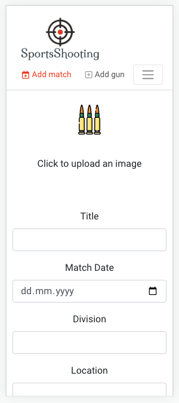

# Testing

Return back to the [README.md](README.md) file.

---

## Automated Testing

I have conducted a series of automated tests on my application.

I have tested the `DeleteModal`, the `NavBar` and the `NotFound` component via jest unit test.

- [DeleteModal Unit Test](src/components/__tests__/DeleteModal.test.js)
- [NavBar Unit Test](src/components/__tests__/NavBar.test.js)
- [NotFound](src/components/__tests__/NotFound.test.js)

I fully acknowledge and understand that, in a real-world scenario, an extensive set of additional tests would be more comprehensive. However, I wanted to include a few example tests to showcase the use of jest in a React app. It turned out to be quite difficult, if more complex components containing lots of states, are tested.

### JEST Unit Testing

I have used [jest](https://jestjs.io) for the java script unit testing. In order to run the tests, I ran the following command in the terminal each time:

`npm test`

All testcases have been successfully executed and passed:

The following table shows a summary of testcases executed. The the `DeleteModal`, the `NavBar` and the `NotFound` component got tested via the automated unit testing.

| Class | Function | Description | Comment |
| --- | --- | --- | --- |
| DeleteModal.js |  |  |  |
|  | renders DeleteModal with correct content | The modal displays the title "Confirm Deletion", show a text "Are you sure you want to delete this item?" and have two buttons: "Cancel" and "Delete" |  |
|  | calls the handleClose function when Cancel button is clicked | the mock function `handleClose` is called | `jest.fn()` mock function is created for the `handleClose` |
|  | calls the handleConfirm function when Delete button is clicked | the mock function `handleConfirm` is called | mock setup initially done |
| NavBar.js |  |  |  |
|  | renders NavBar | link with the name "SignIn" is present in the document |  |
|  | renders link to the user profile for a logged in user | the profile avatar is in the document together with a link named "apple" pointing to /profiles/1 | "apple" is the testuser |
|  | renders sign in and sign up buttons again on log out and check all available links | the "SignIn & SignUp" link is present in the document. "Add match & Add gun" is **not** present|  |
|  | renders logged-in navigation items when user is authenticated | links for authenticated user "Add match & Add gun & MySchedule & MyGuns & signOut" are all present |  |
| NotFound.js |  |  |  |
|  | renders NotFound component with correct message | image in form of "img" is present with error message "Sorry, the page you're looking for doesn't exist"  |  |
|  |  |  |  |

## Manual Testing

### User Story Testing
`OPEN TO DO`

I have tested the functional user stories and listed in the following table, together with a screenshot. Since I did also add user stories for admin tasks like documentation, app submission, I did not include them in the table - since snapshots are difficult for those. However, they are also clearly documented in the README section.

`REUSE TABLE FROM README`

User story testing Table with Snapshots

`REUSE TABLE FROM README`

---

### Defensive Programming

| Page | User Action | Expected Result | Pass/Fail | Comments |
| --- | --- | --- | --- | --- |
| Main Site |  |  |  |  |
|  | Click on Logo in Navbar | Redirect / Refresh Home | Pass |  |
|  |  |  | Pass |  |
|  |  |  | Pass |  |
|  |  |  | Pass |  |
|  |  |  | Pass |  |
|  |  |  | Pass |  |
|  |  |  | Pass |  |
|  |  |  | Pass |  |
|  |  |  | Pass |  |
|  |  |  | Pass |  |
|  |  |  | Pass |  |
|  |  |  | Pass |  |
|  |  |  | Pass |  |

---

## Code Validation

### W3C HTML Validation
`OPEN TO DO`

I have used the recommended [HTML W3C Validator](https://validator.w3.org) to validate all of my HTML files.

As my project uses jsx syntax, it will not validate properly if I copy and paste into the HTML validator straight from my source files.

Usually in order to properly validate these types of files, it's recommended to
[validate by uri](https://validator.w3.org/#validate_by_uri) from the deployed Heroku pages.

Unfortunately, nearly all of the pages on this site require a user to be logged-in and authenticated,
and will not work using this method, due to the fact that the HTML Validator (W3C) doesn't have
access to login to the pages.

In order to properly validate my HTML pages with Jinja syntax for authenticated pages, I followed these steps:

- Navigate to the deployed pages which require authentication
- Right-click anywhere on the page, and select **View Page Source** (usually `CTRL+U` or `⌘+U` on Mac).
- This will display the entire "compiled" code, without any Jinja syntax.
- Copy everything, and use the [validate by input](https://validator.w3.org/#validate_by_input) method.
- Repeat this process for every page that requires a user to be logged-in/authenticated.

In the following table, all W3C testing is presented with snapshots.

W3C Validation Table with Snapshots

| Page | W3C URL | Screenshot | Notes |
| --- | --- | --- | --- |
| Main | [W3C]() |  | No Errors / Warnings |
| Main | [W3C]() |  | No Errors / Warnings |
| Main | [W3C]() |  | No Errors / Warnings |
| Main | [W3C]() |  | No Errors / Warnings |
| Main | [W3C]() |  | No Errors / Warnings |

---

### W3C CSS Validation
`OPEN TO DO`

I have used the recommended [CSS Jigsaw Validator](https://jigsaw.w3.org/css-validator) to validate my CSS files.

| File | Jigsaw URL | Screenshot | Notes |
| --- | --- | --- | --- |
| .module.css | [Jigsaw]() |  | Pass: No Errors |
| .module.css | [Jigsaw]() |  | Pass: No Errors |
| .module.css | [Jigsaw]() |  | Pass: No Errors |
| .module.css | [Jigsaw]() |  | Pass: No Errors |
| .module.css | [Jigsaw]() |  | Pass: No Errors |
| .module.css | [Jigsaw]() |  | Pass: No Errors |
| .module.css | [Jigsaw]() |  | Pass: No Errors |

---

### ESLint Validation

All JavaScript code was validated using the integrated ESLint JavaScript validator. This validation was a big help during development, since it pointet clearly out if there was misused import, unused variables or missing semi colons or incorrect formating.
After finishing my project, no more errors were shown on the console.

---

### Browser Compatibility
`OPEN TO DO`

I've tested my deployed project on multiple browsers to check for compatibility issues.
I have tested it on Chrome, Safari and Firefox on OSX. I did not test with Edge Browser, since it is also based on Chromium, I would expect the same result as for Chrome browser.

In the table below you can find snapshots of each browser. I did a "walkthrough" of the most important features / workflow, which a user would execute.

Browser Compatibility Testing Table with Snapshots

| Browser | OS | Screenshot | Notes |
| --- | --- | --- | --- |
| Chrome | OSX |  | Works as expected |
| Chrome | OSX |  | Works as expected |
| Chrome | OSX |  | Works as expected |
| Chrome | OSX |  | Works as expected |

---

### Responsiveness

I have tested the application on various devices in terms of responsiveness. I could not find any blocking issue. Furthermore, I did take great care and have added some media queries, just for the small screens, because I did not like some of the components, when they were small.
I have to say, all in all, it looks good also on small devices. However, on very small screens, some part could be "more beautiful", but in my opition, this would require to redesign the app or enhance massively. 
I think, the current state is quite good in terms of responsiveness.

Below a table, where I did chooce a set of *testcases* to be run on each device. It includes a variety of mobile devices, starts with the iPhone SE, which is a *medium* screen, over the iPhone 12 Pro, which has a *larger* screen. To verify the app on a very small screen, I have chosen the Samsung Galaxy Fold.
In order to test the tablet category, the iPad Air has been used.

Responsiveness Testing Mobile Devices

| Device | Site | Snapshot | Result |
| --- | --- | --- | --- |
| iPhone SE |  |  |  |
|  | Match Add |  | no issues found |
|  | Match Detail |  | no issues found |
|  | Matches List |  | no issues found |
|  | MyGuns Add |  | no issues found |
|  | MyGuns Delete Modal |  | no issues found |
|  | MyGuns List |  | no issues found |
|  | MyGuns Serach Fail |  | no issues found |
|  | MySchedule List |  | no issues found |
|  | NavBar |  | no issues found |
|  | Profile Edit |  | no issues found |
|  | Profile List |  | no issues found |
|  | SignIn |  | no issues found |
| iPhone 12 Pro |  |  |  |
|  | Match Add |  | no issues found |
|  | Match Detail |  | no issues found |
|  | Matches List |  | no issues found |
|  | MyGuns Add |  | no issues found |
|  | MyGuns Delete Modal |  | no issues found |
|  | MyGuns List |  | no issues found |
|  | MyGuns Serach Fail |  | no issues found |
|  | MySchedule List |  | no issues found |
|  | NavBar |  | no issues found |
|  | Profile Edit |  | no issues found |
|  | Profile List |  | no issues found |
|  | SignIn |  | no issues found |
| Samsung Galaxy Fold |  |  |  |
|  | Match Add |  | no issues found |
|  | Match Detail |  | no issues found |
|  | Matches List |  | no issues found |
|  | MyGuns Add |  | no issues found |
|  | MyGuns Delete Modal |  | no issues found |
|  | MyGuns List |  | no issues found |
|  | MyGuns Serach Fail |  | no issues found |
|  | MySchedule List |  | no issues found |
|  | NavBar |  | no issues found |
|  | Profile Edit |  | no issues found |
|  | Profile List |  | no issues found |
|  | SignIn |  | no issues found |
| iPad Air |  |  |  |
|  | Match Add |  | no issues found |
|  | Match Detail |  | no issues found |
|  | Matches List |  | no issues found |
|  | MyGuns Add |  | no issues found |
|  | MyGuns Delete Modal |  | no issues found |
|  | MyGuns List |  | no issues found |
|  | MyGuns Serach Fail |  | no issues found |
|  | MySchedule List |  | no issues found |
|  | NavBar |  | no issues found |
|  | Profile Edit |  | no issues found |
|  | Profile List |  | no issues found |
|  | SignIn |  | no issues found |

---

### WAVE WebAim Testing

`CHECK IF THIS HAS TO BE DONE OR NOT`

### Lighthouse Audit
`OPEN TO DO`

I've tested my deployed project using the Lighthouse Audit tool to check for any major issues.

---

## Bugs

### GitHub **Issues**

I did use GitHub Issues to track all my work, as already explained in the Agile Development section of the README. Below a snapshot with an excerpt:

The intention was to also track the bugs with github issus via adding a `bug`, opening them as stories and add them to the kanban board.
Since I did start from the beginning to deploy my project to Heroku, I did continuously verify the state of the application. Furthermore, each feature was locally tested, before / just after commit. Therefore I could fix most of the issues during the development phase. I did not open bugs when discovering an issue while being still on the development face of that particular feature.

**Fixed Bugs**

As previously mentioned, I did only start "counting" bugs when doing the testing of the front and back end application, hence the development process was finished. Since I did heavy testing during development, I could find potential issues already then. Therefore the list with bugs, found during the finalt testing round, is empty.

| Bug | Status |
| --- | --- |
| [Profile Social Media URL Error](https://github.com/rpf13/sportsshooting_react/issues/44) | resolved |
| [Gun Create form image validation error missing](https://github.com/rpf13/sportsshooting_react/issues/45) | resolved |

**Open Issues**

When writing / submitting my project for assessment, there were no open issues, bugs I am aware of. However, the epic with the stretch items / future features is still in the open state. Such epics, stories got the `WontHave` tag during MoSCoW priorisation. 
Any remaining open issues can be tracked [here](https://github.com/rpf13/sportsshooting_react/issues).

## Unfixed Bugs

There are no remaining bugs that I am aware of.

---
